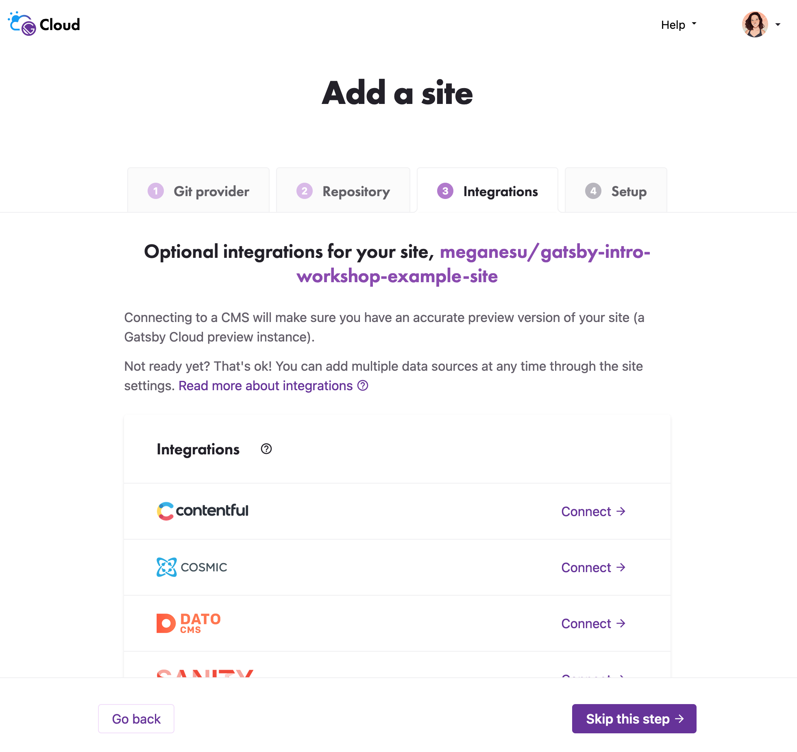

## Introduction

Now that you've set up your computer with all the tools you'll need, it's time to get started!

In this section, you will go through the process of creating and deploying your first Gatsby site.

## What You Will Learn

By the end of this section, you will be able to:

* Create a new Gatsby site.
* Deploy your site using Gatsby Hosting.

## Background

### Creating a Gatsby site

The Gatsby command line interface (CLI) has a command you can use to create a new Gatsby site: `gatsby new`.

This command brings up an interactive prompt that will ask you questions about the site you want to build. After you enter the information, the CLI will automatically generate your new Gatsby site based on your answers.

Since this is an introductory workshop, don't add any of the extra integrations yet. You'll add them yourself later on. (But for future projects, know that you can use the CLI to set those features up automatically!)


### Running your site locally

There are two ways you can run your site locally. In your terminal, change into the directory for your site, then run one of the following sets of commands:

* Option 1: `gatsby develop`
    * This starts up a local development server. It has some features that make it easier to work on your site. For example, hot reloading will trigger your site to rebuild automatically after you make changes to a file.
    * You can see your site in a browser by visiting `localhost:8000`.
* Option 2: `gatsby build` and then `gatsby serve`
    * `gatsby build` will create a production-style build of your site and put it in the `public/` directory. `gatsby serve` starts up a local server that uses the code in `public/` directory.
    * You can see your site in a browser by visiting `localhost:9000`.
    * A prod-style build has more optimizations, but you'll lose some developer-experience features like hot reloading. 

In this workshop, you'll primarily use `gatsby develop`.

### Setting up a GitHub repo for your site

GitHub is a website that many developers use to back up and share their code online. By uploading your code to GitHub, you'll be able to work on the same codebase from multiple computers. You'll also be able to use Gatsby Cloud to build and host your site.

1. Each codebase on GitHub is stored in its own **repository** (also called a "repo", for short). To create a new repository for your blog, click the plus icon in the top-right corner of the navigation bar. Select "New repository".

    

1. When filling out the form for your new repo, you can make it public or private. Leave the "Add a README file", "Add .gitignore", and "Choose a license" checkboxes unchecked.

1. To push your existing code from your computer to GitHub, enter the following commands from your terminal:

    ```shell
    git remote add origin https://github.com/YOUR_GITHUB_USERNAME/YOUR_GITHUB_REPO_NAME.git
    git branch -M main
    git push -u origin main
    ```

### Build your site with Gatsby Cloud

Gatsby Cloud is a custom-built infrastructure platform that is specifically tailored to building and deploying Gatsby sites.

You can connect your codebase to Gatsby Cloud through GitHub:

1. Go to your [Gatsby Cloud Dashboard](https://gatsbyjs.com/dashboard/). Click on the purple "Add a site" button next to the search bar.

    

1. The next few steps will help you go through the steps to create a new site. First, select "Import from a Git repository" and click the "Next" button at the bottom of the page.

    

1. Select GitHub as the Git provider.

    

1. Select your GitHub username from the "Select an Organization" dropdown. If your username is not listed, choose "Add new Organization", which will open a new window with GitHub. The next few steps will show you how to give Gatsby Cloud access to your GitHub repo.

    

1. The new GitHub window will ask you where you want to install Gatsby Cloud. Find your username in the list of organizations, and click the corresponding "Configure" button.

    

1. GitHub will take you to the permissions page for Gatsby Cloud.

    

1. In the "Repository access" section, you can choose to give Gatsby Cloud access to all your repos or only select repos. To give access to select repos, use the "Select repositories" dropdown to find the name of the repo you created for your project. **Don't forget to save your changes!**

    

1. Now, when you go back to the Gatsby Cloud window, you should be able to find your repo using the "Select a Repository" field.

    

1. Once you select your repo, a few more options will show up, which you can use to configure the branch and display name that Gatsby Cloud will use for your site. You can leave the default settings and click the "Next" button.

    

1. Gatsby Cloud will ask you if you want to add any optional integrations to your site. For future projects, this might be useful if you want to use a CMS. But for now, click the "Skip this step" button.

    

1. Gatsby Cloud will also ask if you want to add any environment variables. Skip this section, and click the "Create site" button.

    

1. Now that your site has been created, you'll be taken to a site dashboard where you can see the status of your builds. Gatsby Cloud should start building your site automatically.

    

Every time you push a new change to the main branch of your GitHub repo, Gatsby Cloud will see the changes and automatically start a build for the new version of your site.

There will be a unique URL for each build (like `https://build-49535320-b3ae-4761-bbeb-f8f7fa07e0fc.gtsb.io/`), and a URL that always has the latest build (like `my-awesome-repo-main.gtsb.io`).

### Setting up Gatsby Hosting

Gatsby Cloud now includes hosting! That means that other people will be able to access your site using a URL that ends with `.gatsbyjs.io`.

To set up Gatsby Hosting:

1. Go into the "Site Settings" tab for your site. 
1. Select "Hosting" from the sidebar.
1. Find the "Deploy to Gatsby Hosting" section, and click the "Turn on" button.


## Challenge (Extra Credit)

If you have a custom domain you'd like to connect to your site, you can set it up in Gatsby Cloud by following the instructions in this doc: [Adding a Custom Domain](https://www.notion.so/gatsbyjs/Adding-a-Custom-Domain-b711146c4f8146a380bb0ba96fad1928).

## Summary

Now that you've created the skeleton for your site and deployed it to Gatsby Cloud, you have a link to your site that you can share with anyone!

In the next section, you'll learn how to customize the contents of your site using React.
