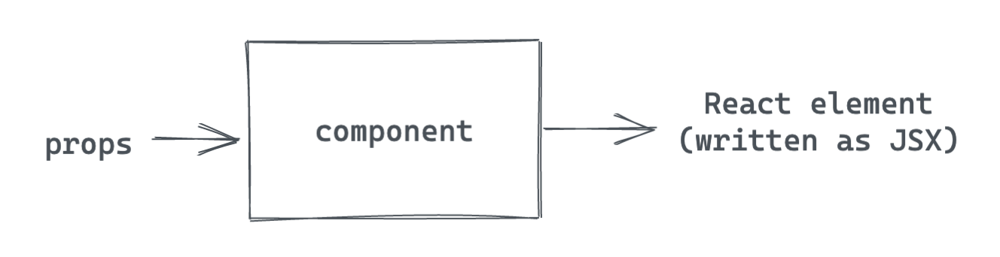

import Calloutbox from "../../components/callout-box";
import PreviousNext from "../../components/nav/previous-next";

## Introduction

In the previous section, you created your first Gatsby site and used Gatsby Cloud to deploy it to the internet.

Now that you have everything all set up, it's time to make this site your own! In order to customize your site, you'll need to learn about React components and how Gatsby uses them.

<Calloutbox>

React is the JavaScript library that Gatsby uses under the hood to create user interfaces (UIs). In this section, you'll learn about the different kinds of **components** in Gatsby, which will help you create new pages and UI elements for your site.

</Calloutbox>

## What You Will Learn

By the end of this section, you will be able to:

* Add new pages to your site by creating page components
* Use a pre-built component from another package
* Create your own reusable component
* Use props to change the way a component renders
* Use the `children` prop to create wrapper components

## Background

### What is React?

Gatsby uses a JavaScript library called React to build UIs. With React, you can break down your UI into smaller, reusable pieces called **components**.

For example, imagine the UI for a store's website. To build this site in React, you might have a `<Navbar>` component for the navigation menu, a `<Sidebar>` component for any additional information displayed to the side of the main content, and a `<ProductGrid>` component to display all of the products for sale.

You can also create components from other components. For example, you might break down the `<ProductGrid>` component into a list of `<ProductCard>` components, to display the details about a single product.


### A Closer Look at React Components

Under the hood, a React component is a function that returns a React element. A **React element** is an object that React uses to render DOM elements.

The simplest way to write React elements is with **JSX**. JSX is a JavaScript syntax extension that describes the DOM structure for your component. It looks a bit like having HTML in your JavaScript files:

```javascript
const hello = <h1>Hello world!</h1>
```

One powerful aspect of JSX is that you can embed JavaScript expressions into your JSX. You can put JS expressions into your JSX using curly brackets `{}` For example, this code snippet will swap out the name in the greeting element based on the value of the `name` variable:

```javascript
const name = "Megan"
const greeting = <p>Hi {name}!</p>
```

<Calloutbox>
To summarize, a React component is a function that returns a React element. In this workshop, you'll write your React elements using JSX.


</Calloutbox>

### Writing a React Component

The basic structure of a React component looks like this:

```javascript
// my-component.js

// Step 1: Import React. This lets you use JSX.
import React from 'react'

/* Step 2: Define your component. Note that your
component name should start with a capital letter. */
const MyComponent = () => {
  return (
    <h1>Hi, welcome to my site!</h1>
  )
}

/* Step 3: Export your component so it
can be used by other parts of your app. */
export default MyComponent
```

Your component must return a single React element, but you can put as many elements inside that top-level element as you want. The code snippet below shows an example of a valid component and an invalid component:

```javascript
import React from 'react'

const ValidComponent = () => {
  return (
    <div>
      <h1>A valid component!</h1>
      <p>This will work fine.</p>
      <p>
        Since there is only one top-level element: the div.
      </p>
    </div>
  )
}

const InvalidComponent = () => {
  return (
    <h1>This won't work.</h1>
    <p>Because there are two elements at the top level.</p>
  )
}
```

If you try to build your site with the code above, you'll get an error for `<InvalidComponent>` like this:

```shell
Parsing error: Adjacent JSX elements must be
wrapped in an enclosing tag. Did you want a JSX fragment
<>...</>?
```

#### Components with props

You can use component **properties** (also called "props", for short) to change the way a component renders. Think of them like arguments that you pass into your component function.



The code snippets below show an example of how to pass a prop into a component when it's rendered and how to use the value of that prop within the component definition.

```javascript
// When the <Greeting> component is rendered
const SayHello = () => {
  return (
    <Greeting name="Megan" />
  )
}
```

```javascript
// When the <Greeting> component is defined
const Greeting = ({ name }) => {
  return (
    <p>Hi {name}</p>  
  )
}
```

<Calloutbox>

Who's ready for an analogy? In the video below, Laurie Barth explains React components and props using LEGO.

<blockquote class="twitter-tweet"><p lang="en" dir="ltr">Components explained with LEGO! <a href="https://t.co/18jektrKgw">pic.twitter.com/18jektrKgw</a></p>&mdash; Laurie (@laurieontech) <a href="https://twitter.com/laurieontech/status/1357497069766868993?ref_src=twsrc%5Etfw">February 5, 2021</a></blockquote>

</Calloutbox>

#### Components with `children`

You can add whatever props you want to your components. But React also creates some props for you automatically.

One such prop is called `children`. When you render a component, the `children` prop will automatically be passed whatever content comes between the opening and closing tags of the component. This is helpful when you want to create a component that wraps some generic content.

Think of it like a framed painting. If you're building a `<Frame>` component, the component definition should specify the shape and style of the frame. But you can swap out the contents of the frame with whatever painting you want. You could even put in something besides a painting, like a photo or a piece of embroidery.


Here's an example of what the code for this scenario might look like. First, when the `<Frame>` component is rendered, it has contents passed in between the opening and closing tag:

```javascript
// src/pages/index.js

<Frame>
  <p>This will be passed in as children</p>
</Frame>
```

Then in the component definition, the `children` prop will get passed whatever elements came between the opening and closing tag. You can render the `children` prop in your JSX to insert the contents.

```javascript
// src/components/frame.js
import React from 'react'

const Frame = ({ children }) => {
    return (
        <div>
            <h1>This is the page title</h1>
            { children }
        </div>
    )
}

export default Frame
```

In the browser, the actual DOM elements will look something like this:

```html
<div>
  <h1>This is the page title</h1>
  <p>This will be passed in as children</p>
</div>
```

<Calloutbox>

For more information, check out these resources about React    `children`:

* Netlify Blog: [React Children: The misunderstood prop](https://www.netlify.com/blog/2020/12/17/react-children-the-misunderstood-prop/)
* Official React documentation: [JSX In Depth: Children in JSX](https://reactjs.org/docs/jsx-in-depth.html#children-in-jsx)

</Calloutbox>

### Types of Components in a Gatsby Site

There are two different categories of components in a Gatsby site: page components and "building block" components.

A page component is like a LEGO project from a kit. It includes all the UI elements needed for an entire page.

A "building block" component is like a single LEGO brick. On its own, it doesn't do much. But it can be combined with other components to create a complete UI.


### Page Components

Page components are React components that include all the UI elements for an entire page of your website.

To see an example of a page component, look at the `src/pages/index.js` file in your site. This page is actually a component! (See how it has the same three pieces highlighted in the "Writing a React Component" section?)

Gatsby automatically creates pages for React components that are the default export of files in the `src/pages` directory.

For more information, check out the Gatsby documentation: [Reference Guide: Creating Routes](https://www.gatsbyjs.com/docs/reference/routing/creating-routes/#routes-defined-in-srcpages).

### "Building Block" Components

<Calloutbox>

**Note:** The term "building block" component isn't an official technical term. It's just the best name we could come up with to describe this kind of component.

</Calloutbox>

Not every component has to be a full page. You can use smaller "building block" components for specific UI elements. That way, you can reuse parts of your UI across your site.

"Building block" components can be grouped into one of two categories: **pre-built** components that you import from another package, or **custom** components that you build yourself.


#### Pre-Built Components

Sometimes, it's easier to use a component written by someone else. Gatsby has some built-in components that are predefined as part of the framework. You can import these and use them in your project.

One of these components is the `<Link>` component. You can use Gatsby's `<Link>` component instead of an `<a>` tag when you're linking to another page within your site.

<Calloutbox>

The Gatsby `<Link>` component provides a performance feature called **preloading**. This means that the resources for the linked page are requested when the link scrolls into view or when the mouse hovers on it. That way, when the user actually clicks on the link, the new page can load super quickly.

For more information about the `<Link>` component, check out the Gatsby documentation: [Reference Guide: Gatsby Link API](https://www.gatsbyjs.com/docs/reference/built-in-components/gatsby-link/)

</Calloutbox>

The basic process for using pre-built components in your site is:

1. Import the component into the page or component you want to use it in.
1. Add the component to the JSX returned by the page or component.

The code snippet below shows how to use the Gatsby `<Link>` component in your own site:

```javascript
// src/pages/index.js

// Step 1: Import the <Link> component
import { Link } from 'gatsby'

// Step 2: Add the <Link> component to the JSX returned
<Link to="/about">
  Go to the About page
</Link>
```

The `<Link>` component takes a `to` prop, which is similar to the `<a>` tag's `<href>` attribute. The value should be the URL path you want the link to navigate to.

#### Custom Components

You can also build your own React components. The general process looks like this:

1. Write the component definition.
1. Import the custom component into the page or component file where you want to render it.
1. Add your custom component to the JSX returned by the page or other component.

For example, the two code snippets below show how you might create your own custom `<Button>` component and then add it to your Home page:

```javascript
// src/components/button.js

import React from 'react'

const CustomButton = () => {
  return (
    <button>This button is so customized!</button>
  )
}

export default CustomButton
```

```javascript
// src/pages/index.js

import React from 'react'
import CustomButton from '../components/button'

const IndexPage = () => {
  return (
    <main>
      ...
      <CustomButton />
      ...
    </main>
  )
}
```

### Styling Components

Gatsby isn't strict about what styling approach you use. You can pick whatever system you're most comfortable with.

For this workshop, you'll use CSS modules. This means that styles will be scoped to components (which helps avoid naming conflicts with classes). Gatsby is automatically configured to handle CSS modules - no extra setup necessary!

To define styles using CSS modules, use the file extension `.module.css`. Within your CSS file, create separate CSS classes for each elemenet you want to style. For example:

```css
// src/components/my-component.module.css

.title {
  color: blue;
  font-size: 3rem;
}
```

Then, in your component file, import your styles and apply the individual classes to each element:

```javascript
// src/components/my-component.js

import styles from './layout.module.css'

// In the JSX returned
<h1 className={styles.title}>
  Super Sweet Title Page
</h1>
```

<Calloutbox>

**Note:** To apply classes to React components, use the `className` prop. (This might be confusing if you're used to using the `class` attribute on HTML elements. Do your best to not mix them up!)

</Calloutbox>


## Exercise #1: Create a new page

### Goal

Add an `/about` page to your site.

<details>
  <summary>Hints</summary>

* Gatsby will automatically create pages for any React components that are the **default export** of a file in the `src/pages` directory.
* The route to the page created will be based on the path to the `.js` file for that page.

</details>

<details>
  <summary>Solution</summary>

You'll learn more if you work through the exercise on your own.

But if you get stuck, here's [one possible solution](https://github.com/meganesu/gatsby-intro-workshop-example-site/commit/0b637061374f36ae8594bfc389de529d57e65096).

</details>

## Exercise #2: Use the `<Link>` component to create a simple navbar

### Goal

Use the built-in `<Link>` component from the `gatsby` package to add a simple navigation bar to your Home and About pages.

* Add a link to the Home page on the About page.
* Add a link to the About page on the Home page.

<details>
  <summary>Hints</summary>

* Here's a refresher of the syntax for using the `<Link>` component:
    ```javascript
    import { Link } from 'gatsby'

    // In your component's return statement:
    <Link to='/page-url'>
      Text to be linked
    </Link>
    ```
* To get the path to your Home page, set the `to` prop to `/`.

</details>

<details>
  <summary>Solution</summary>

You'll learn more if you work through the exercise on your own.

But if you get stuck, here's [one possible solution](https://github.com/meganesu/gatsby-intro-workshop-example-site/commit/0eedf302c7606e5d8549bd3f2ad6bbb957dd25af).

</details>

## Exercise #3: Create a reusable Layout component

### Goal

Create a Layout component with a header and navigation bar. Use CSS modules to style your Layout component.

<details>
  <summary>Hints</summary>

1. Create a Layout component in a new file. (Use the `<Link>` component to create the navigation bar.)
1. Import the Layout component into your existing page components (`src/pages/index.js` and `src/pages/about.js`).

</details>

<details>
  <summary>Solution</summary>

You'll learn more if you work through the exercise on your own.

But if you get stuck, here's [one possible solution](https://github.com/meganesu/gatsby-intro-workshop-example-site/compare/0eedf302c7606e5d8549bd3f2ad6bbb957dd25af..6bcc39da7904a8860f02a086060a6faf0c1a08c0).

</details>

## Challenge (Extra Credit)

Use what you've learned so far to create some new components for your site!

Here are a few ideas:

* Add a `/contact` page with relevant links.
* Add a `<CallToAction>` component that wraps important text that you want to stand out.
* 🌶 Add an interactive `<Bio>` component where you can toggle between a short and long version of your introduction. 
* 🌶 Add an expandable navigation menu.

<Calloutbox>

The 🌶 emoji indicates ideas that require additional React knowledge that wasn't covered in this workshop. If you have previous React experience (or you want an extra challenge), give them a try!

</Calloutbox>

## Summary

Nice work, you made it to the end of the section! (This was a long one!)

<Calloutbox>

Don't forget to commit your changes! Push them to GitHub. When your Gatsby Cloud build finishes running, you should be able to see your changes reflected at your site's "latest build" URL.

</Calloutbox>

### Check For Understanding

* How would you create a new /contact page?
    * Create a file at src/pages/contact.js. Create a new page component in that file.
* What are the three steps for creating a new component?
    * Import React, so that you can use JSX
    * Define your component by creating a function that returns JSX.
    * Export your component so that other files can use it.
* What is a component prop?
    * A piece of data that you pass into the component when it's rendered.The value of the prop changes the way the component renders.

### Key Takeaways

The key takeaways from this section are:

* Components let you reuse parts of your UI in different places.
* You can use props to change how a component renders.
* Gatsby automatically creates pages for components that are the default exports of files in the `src/pages` directory.
* Gatsby has some built-in components (like the `<Link>` component) that you can import and use in your site.

### Up Next

In the next section, you'll learn about how to add more pre-built functionality to your site using Gatsby plugins.

<Calloutbox>

**Share Your Feedback!**

You can help us improve this workshop by using this [feedback form](https://docs.google.com/forms/d/e/1FAIpQLScQSMjKfAaukPiiwvPTpIG3nKEF5pjY0Y_nZX6TGj0L9Tx31w/viewform?usp=pp_url&entry.2075407804=Part+2) to tell us what you liked or didn't like about this part of the workshop.

</Calloutbox>

<PreviousNext
  prevTo="/part-1"
  prevText="Part 1"
  nextTo="/part-3"
  nextText="Part 3"
/>
