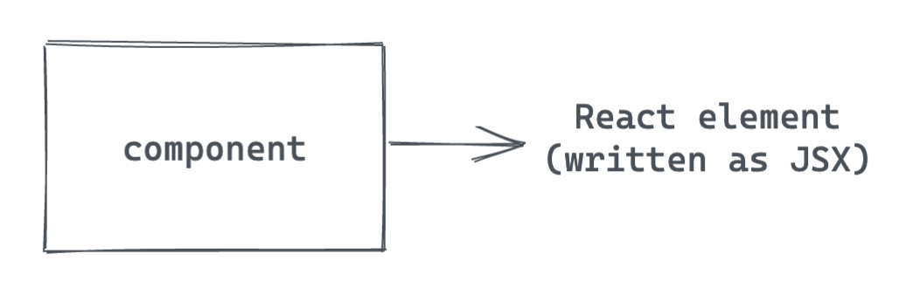

## Introduction

In the previous section, you created your first Gatsby site and used Gatsby Cloud to deploy it to the internet.

Now that you have everything all set up, it's time to make this site your own! In order to customize your site, you'll need to learn about React components and how Gatsby uses them.

React is the JavaScript library that Gatsby uses under the hood to create user interfaces (UIs). In this section, you'll learn about the different kinds of components in Gatsby, which will help you create new pages and UI elements for your site.

- "In the previous section, you learned..." Refresh their knowledge for anything they’ve learned in the previous sections that will be relevant to this part.
- Brief paragraph (2-3 sentences) to highlight context and relevance.
- Explain the goal of this part of the tutorial. Show diagrams, list acceptance criteria for desired end result.

## What You Will Learn

- How to create a React component using JSX
- How to create a page component
- How to create a reusable component
- Import an existing component into a page or another component
- How to use built-in Gatsby components
- How to use props to change the way a component renders

## Agenda

- Bullet list to show the big picture of the steps in this part
- Callout box with a link to starter branch for this section (so they can catch up if they haven’t been following along). "If you haven't done the previous sections of the Tutorial, you can still follow along from here. Clone the [whatever we call it] repo and check out the branch called `name-of-branch`."

## Learning Guide

### 👩‍🏫 A Crash Course on React Components

Gatsby uses a JavaScript library called React to build UIs. With React, you can break down your UI into smaller, reusable pieces called components.

Brief intro to React for newcomers.

- A component is a function that returns a React element. We'll write our React elements using JSX.
  
  - Explain the _basic_ structure of a component.
    ```js
    const PageTitle = () => <h1>Welcome to my site!</h1>;
    ```
- There are two different categories of components in a Gatsby site: page components and smaller, reusable components (UI components?)
  

### 👩‍🏫 Page components:

- React components that live in `src/pages` directory. Look at src/pages/index.js. This page is actually a component. Gatsby automatically turns the default export of files in src/pages into pages on your site.

### 💻 Step 1: Create a new page component

**Goal:** Add an `/about` page to your site.

1. Create a new file: `src/pages/about.js`.
1. In your new file, create a new page component for your About page. (Don't forget to make it the default export!)
1. Go to `localhost:8000/about` to see your new page.

### 👩‍🏫 Reusable components

Not every component has to be a full page. You can create smaller components for specific UI elements. That way, you can reuse parts of your UI across your site.

You can either import pre-built components from a package that someone else wrote, or you can create your own components.


👩‍🏫 Pre-built components: You can import components that were built by someone else.

- Gatsby has some built-in components that are predefined as part of the framework. You can import these and use them in your project, the same way you’d use a reusable component you wrote yourself.
- Use `<Link>` component to create a navbar
- Explain props. They’re a way to change the way a component renders. (Like arguments passed into a function.)
  
  - You can use props in any React component, not just the built-in Gatsby ones.
    - You can put JS expressions into your JSX using curly brackets `{}`
- The `<Link>` component takes a `to` prop.

Basic structure:

1. Import the component
1. Use the component in the JSX for another component.

### 💻 Step 2: Add a link to the About page on the home page

- Import the `<Link>` component in `src/pages/index.js`.
- Use the `<Link>` component to add a link to the /about page on the home page.

👩‍🏫 Custom components:

- You can also build your own components.

Basic structure:

1. Write the component definition
1. Import the component
1. Use the component in the JSX for another component.

### 💻 Step 3: Create a Layout component

- Create a Layout component (src/components/layout.js) with a header and navbar (using Link component)
- Add the layout component in the existing page components (index.js and /about page).
- Use props to make the header component dynamic

Styling

- Explain: Use CSS in JS
- Add styles to Layout component

### Challenge (extra credit)

Add some new components of your own. Style them.

1. Don't forget to commit your changes! Push them to GitHub. When your Gatsby Cloud build finishes running, you should be able to see your changes reflected at your site's "latest build" URL.

## Summary

### Check For understanding

- How would you create a new /contact page?
  - Create a file at src/pages/contact.js. Create a new page component in that file.
- What are the three steps for creating a new component?
  - Import React, so that you can use JSX
    - Define your component by creating a function that returns JSX.
    - Export your component so that other files can use it.
- What is a component prop?

  - A piece of data that you pass into the component when it's rendered.The value of the prop changes the way the component renders.

- Link to the “solution” code for this section
- Bullet list of key takeaways (alt: checks for understanding, using `<details>` elements?)

### Takeaways

- Types of components:
  
- Files in the src/pages directory automatically get built into pages on your site
- Components let you reuse parts of your UI in different places
- You can use props to change how a component renders
- Gatsby has some built-in components that you can use for free!

## Up Next

- 1-2 sentences teasing how this section connects to the next section (no details, just enough of a hook to motivate them to keep going)

[Go to Part 3 &rarr;](/part-3)

[Go back to Home &rarr;](/)
