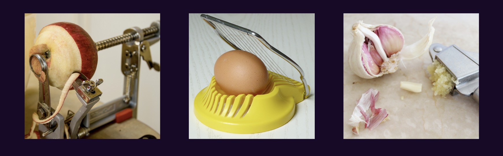
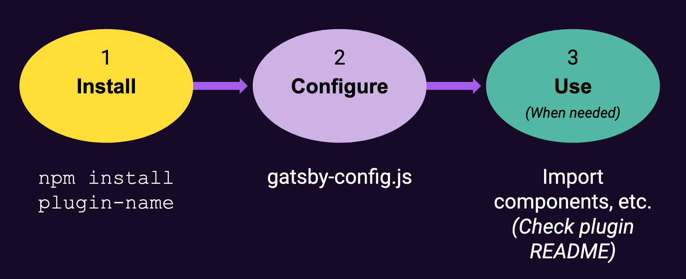
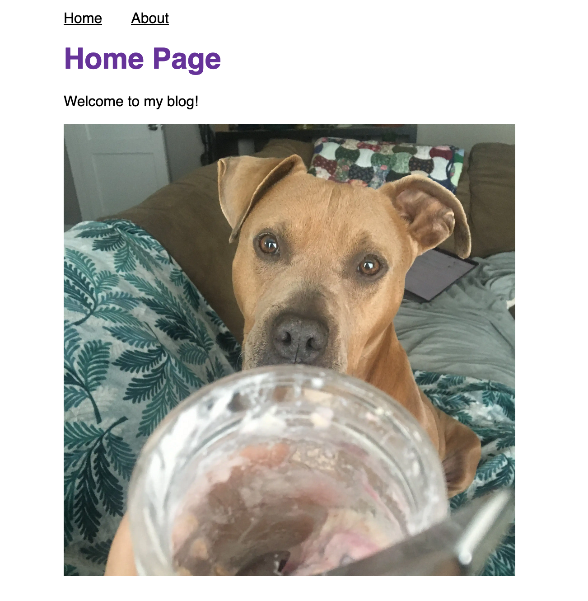

import Calloutbox from "../../components/callout-box";
import PreviousNext from "../../components/nav/previous-next";

## Introduction

It can be a lot of work to build new features for a website. Luckily, Gatsby's plugin ecosystem has thousands of prebuilt packages for you to choose from. By using a plugin, you can quickly add new functionality to your site without needing to build it from scratch yourself.

In this section, you'll learn what plugins are and how to use them in your site.

## What You Will Learn

By the end of this section, you will be able to:

- Install and configure a plugin.
- Use the `StaticImage` component from the `gatsby-plugin-image` plugin.

## Background

### What is a plugin?

In Gatsby terms, a **plugin** is a separate npm package that you install to add extra features to your site.

There are a variety of plugins that each have different use cases. Some plugins provide pre-built components, others add analytics, others let you pull data into your site. Some plugins are built by the team at Gatsby, while other plugins are built and maintained by community members. So far, there are more than 2,600 plugins to choose from. You can look through them using the [Gatsby Plugin Library](https://www.gatsbyjs.com/plugins).

You can think of a plugin as an accessory. You don't _need_ to use plugins in your site (you could build everything yourself), but they save you time. Much like those fancy single-purpose cooking gadgets that peel apples or crush garlic.



### Adding a plugin to your site

Here's the general process of using a plugin in your site:

1. **Install the plugin using npm.**
    - In your terminal, run the following command (swapping out `plugin-name` for the name of the plugin you want to use):
        ```
        npm install plugin-name
        ```
    - Depending on what plugin you're using, there might be more dependencies that you also need to install. Check the specific plugin's README in the plugin library for more details.
1. **Configure the plugin in your `gatsby-config.js` file.**
    - Your `gatsby-config.js` file contains information about your site, including configuration for plugins. You can add a plugin to the `plugins` array.
        ```javascript
        module.exports = {
          siteMetadata: {
            title: "my-cool-blog",
          },
          plugins: ["plugin-name"],
        };
        ```
    - Some plugins require extra configuration options. In that case, you'll add an object to the `plugins` array (instead of a string). If that's the case, the plugin README will have more details on what that object should look like.

    <Calloutbox>

    **Note:** After you make updates to your `gatsby-config.js` file, you'll need to restart your `gatsby develop` process for your changes to be picked up.

    </Calloutbox>

1. **Use the plugin features in your site.**
    - The specifics of this will be different based on what the plugin does. You might import a component or function from the site. You might not need to do anything else at all. Check the plugin's README for more details.



### An Example: `gatsby-plugin-image`

You can use the `gatsby-plugin-image` plugin to add performant images to your site.

The `gatsby-plugin-image` plugin exports a component that you can use to load images from a remote URL or your local file system: `<StaticImage>`.

#### Step 1: Install `gatsby-plugin-image` and dependencies

To use the `<StaticImage>` component, you'll also need to install a few other plugins:

- `gatsby-plugin-sharp`: Handles the actual image processing that is used by `gatsby-plugin-image`.
- `gatsby-source-filesystem`: Lets you pull in data from your filesystem. (You'll learn more about this plugin later. Just install it for now.)

#### Step 2: Configure `gatsby-plugin-image` and dependencies

When you configure your plugins in the `gatsby-config.js` file, you only need to add `gatsby-plugin-image` and `gatsby-plugin-sharp`. You'll configure `gatsby-plugin-filesystem` later on in the workshop.

#### Step 3: Use the `<StaticImage>` component

The `<StaticImage>` component takes two props:

- `src`: The URL to the image you want to load. (This is the same as what you put in the `src` attribute of an `` element.)
- `alt`: The alt text to describe the image. This gets used by screen readers or if there's a problem loading the image.

There are also additional options that you can pass in to control the image size or loading behavior. For the full list of options, refer to the [Reference Guide for `gatsby-plugin-image`](https://www.gatsbyjs.com/docs/reference/built-in-components/gatsby-plugin-image/) in the Gatsby documentation.

#### Additional Resources

You might find these docs useful:

- [How-To Guide: Using `gatsby-plugin-image`](https://www.gatsbyjs.com/docs/how-to/images-and-media/using-gatsby-plugin-image/) - Step-by-step instructions on how to use the `<StaticImage>` component.
- [Reference Guide: `gatsby-plugin-image`](https://www.gatsbyjs.com/docs/reference/built-in-components/gatsby-plugin-image/) - A detailed reference on the properties available in the `<StaticImage>` API.
- [Plugin README for `gatsby-plugin-image`](https://www.gatsbyjs.com/plugins/gatsby-plugin-image/)

## Exercise #1: Add `gatsby-plugin-image`

### Goal

Add an image from a remote URL to the home page.

<details>
  <summary>Hints</summary>

1. Find an image online. Copy the link to that image.
1. Install `gatsby-plugin-image`, `gatsby-plugin-sharp`, and `gatsby-source-filesystem`.
1. Configure `gatsby-plugin-image` and `gatsby-plugin-sharp` in your `gatsby-config.js` file.
1. Use the `<StaticImage>` component from `gatsby-plugin-image` to add an image to the home page.

</details>

<details>
  <summary>Solution</summary>

You'll learn more if you work through the exercise on your own.

But if you get stuck, here's [one possible solution](https://github.com/meganesu/gatsby-intro-workshop-example-site/commit/43d66aec890f22019b10d63e7bb36e3a6a354d72).

</details>



## Exercise #2: Add more plugins!

Choose one or more of the following plugins to add to your site:

- [`gatsby-plugin-react-helmet`](https://gatsbyjs.com/plugins/gatsby-plugin-react-helmet): Add metadata to your `<head>`.
- [`gatsby-plugin-google-gtag`](https://gatsbyjs.com/plugins/gatsby-plugin-google-gtag/): Add Google Analytics.
- [`gatsby-plugin-manifest`](https://www.gatsbyjs.com/plugins/gatsby-plugin-manifest/): Let users add your site to their home screen on mobile browsers.

<details>
  <summary>Hints</summary>

- Refer to the README for each plugin for more details on how to configure and use it.

</details>

## Challenge (Extra Credit)

Browse the [Gatsby Plugin Library](https://www.gatsbyjs.com/plugins), and choose another plugin to add to your site.

## Summary

The key takeaways from this section are:

- A plugin is a package that lets you add new features to your site.
- Using plugins saves you time, since it's faster to install and configure a plugin than it is to recreate the same functionality from scratch.
- The general process for using a plugin is to install it, configure it in your `gatsby-config.js` file, and then (sometimes) to use it in your site.
- You can use the [Gatsby Plugin Library](https://www.gatsbyjs.com/plugins) to browse all the available plugins and learn more about how each one works.

In the next section, you'll learn about a specific category of plugins: plugins that pull data into your site.

<Calloutbox>

**Share Your Feedback!**

You can help us improve this workshop by using this [feedback form](https://docs.google.com/forms/d/e/1FAIpQLScQSMjKfAaukPiiwvPTpIG3nKEF5pjY0Y_nZX6TGj0L9Tx31w/viewform?usp=pp_url&entry.2075407804=Part+3) to tell us what you liked or didn't like about this part of the workshop.

</Calloutbox>

<PreviousNext
  prevTo="/part-2"
  prevText="Part 2"
  nextTo="/part-4"
  nextText="Part 4"
/>
