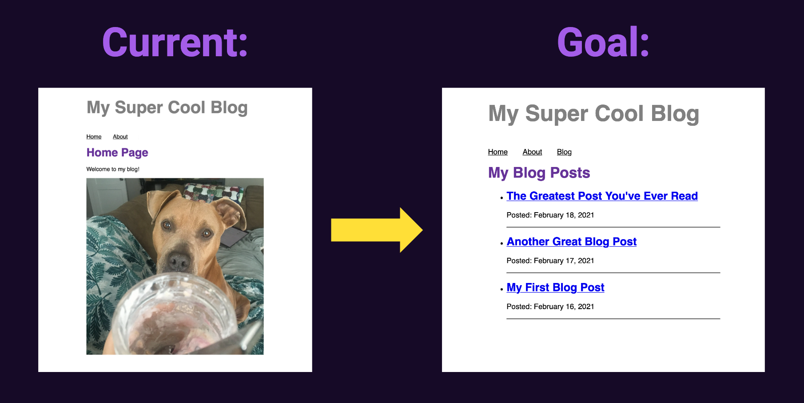

import PreviousNext from "../../components/nav/previous-next";
import Calloutbox from "../../components/callout-box";

## Introduction

So far, you've built a site with a few pages. The next step is to build out the actual blog page!

Eventually, your blog page will link to separate pages for each of your posts. But there's a lot to learn to achieve that, so you'll be working toward that goal for the next few parts of the workshop.

In this first part, you'll learn about how Gatsby pulls data into your site.

## What You Will Learn

- Bullet list of learning objectives (should link to the headings for the corresponding step). Focus on transferable skills.

## Background

### Gatsby's GraphQL Data Layer

### Using GraphiQL to Explore the Data Layer and Write GraphQL Queries

### GraphQL Queries in Components: `useStaticQuery`

### GraphQL Queries in Pages: Page Queries

### MDX Format

## Exercise #1: Write a query in a component

### Goal

Update the `<Layout>` component to pull in the site title from `siteMetadata`.

  
Hints

* Since the `<Layout>` component is not a page component, use `useStaticQuery` to write your query.
* The value of `siteMetadata` can be configured in your `gatsby-config.js` file.

  
Solution

You'll learn more if you work through the exercise on your own.

But if you get stuck, here's [one possible solution](https://github.com/meganesu/gatsby-intro-workshop-example-site/commit/55f3c4c06ad74345ed82a8ae303fcd323ff8f267).

## Exercise #2: Create some MDX blog posts

### Goal

Create a `blog/` directory at least two `.mdx` files for your placeholder blog posts.

Each `.mdx` file should include:

* Front matter with a title and detailed
* Some content with at least a Markdown heading and a paragraph.

  
Solution

You'll learn more if you work through the exercise on your own.

But if you get stuck, here's [one possible solution](https://github.com/meganesu/gatsby-intro-workshop-example-site/commit/943c63f224a2668684e31b70fef3fd612d204cc3).

## Exercise #3: List all the filenames for your blog posts

### Goal

Create a `/blog` page that lists out the filename for each of your posts.

<Calloutbox>

You won't be able to render the contents of your posts just yet, since your site doesn't know how to process MDX. You'll fix that in the next section!

</Calloutbox>

  
Hints

1. Configure `gatsby-source-filesystem` to pull the `.mdx` files for your posts into the data layer.
1. Use GraphiQL to write a query to get the names of all your blog posts.
1. Create a `/blog` page.
    * Add a page query to pull in the data about your posts.
    * Loop over the nodes to display the title of each post. (New to JavaScript? Check out the [MDN documentation for the array `.map()` method](https://developer.mozilla.org/en-US/docs/Web/JavaScript/Reference/Global_Objects/Array/map).)

  
Solution

You'll learn more if you work through the exercise on your own.

But if you get stuck, here's [one possible solution](https://github.com/meganesu/gatsby-intro-workshop-example-site/commit/43a582e1153263cd2021edac453fac9688892a15).

## Challenge (Extra Credit)

- Ideas for how they can take what they learned in this part a step further

## Summary

- Link to the “solution” code for this section
- Bullet list of key takeaways (alt: checks for understanding, using `
` elements?)
  Up Next
- 1-2 sentences teasing how this section connects to the next section (no details, just enough of a hook to motivate them to keep going)

<PreviousNext
  prevTo="/part-3"
  prevText="Part 3"
  nextTo="/part-5"
  nextText="Part 5"
/>
