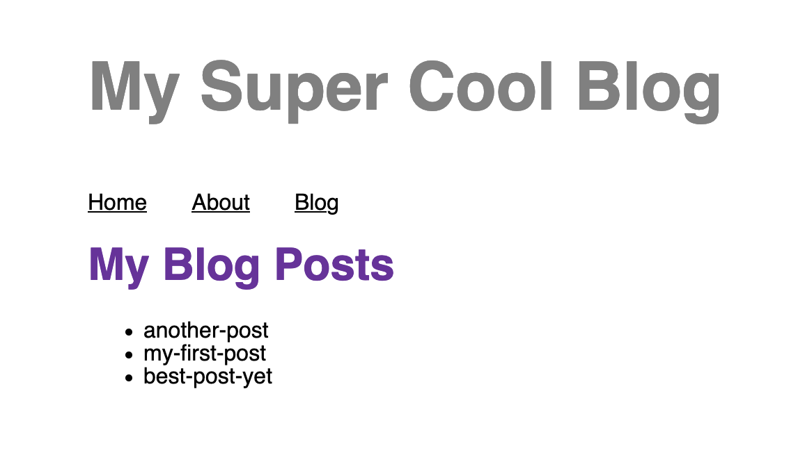

import PreviousNext from "../../components/nav/previous-next";
import Calloutbox from "../../components/callout-box";

## Introduction

So far, you've built a site with a few landing pages. The next step is to build out the actual blog page!


Eventually, your blog page will link to separate pages for each of your posts. But there's a lot to learn to achieve that, so you'll be working up to that goal over the next few parts of the workshop.

In this first part, you'll learn about how Gatsby pulls data into your site.


## What You Will Learn

By the end of this section, you will be able to:

- Use GraphiQL to build your own GraphQL queries.
- Create a page query to pull data into a page component.
- Use the `useStaticQuery` hook to pull data into a "building block" component.
- Use the `gatsby-source-filesystem` plugin to pull data into your site from your local file system.
- Create an MDX file with front matter.

## Background

### Gatsby's GraphQL Data Layer

One of the really powerful features of Gatsby is that you can pull data into your site from anywhere. For example, you might want to store your blog content in WordPress and your products in Shopify. With Gatsby, you can use the best tool for each type of data in your site.

But how does this work under the hood? Gatsby has its own GraphQL **data layer** where it keeps all the data for your site. You can add special plugins to your site called **source** plugins. When you build your site, each source plugin will pull data from a particular place into the GraphQL data layer for your site.

There are different source plugins for a variety of different data sources. You can find source plugins for your file system, several different content management systems (CMSs), private APIs, or databases.

Once the data is in the data layer, you can write GraphQL queries inside of pages or components to pull out the data you want to use in your site.


<Calloutbox>

Interested in learning more about GraphQL? [How To GraphQL](https://www.howtographql.com/) is a free tutorial that teaches you the fundamentals.

</Calloutbox>

### Using GraphiQL to Explore the Data Layer and Write GraphQL Queries

How do you know what data is in your site's GraphQL data layer? When you run your site in develop mode, Gatsby automatically creates a special endpoint that lets you use **GraphiQL**. GraphiQL is an in-browser tool that you can use to explore your site's data and build GraphQL queries.

You can view GraphiQL by going to `http://localhost:8000/___graphql` in your browser. (That's three underscores in the URL.)


There are three main sections of the GraphiQL interface:

* **Explorer:** This shows you all the different kinds of data you can request in a GraphQL query.
    * You can toggle the dropdowns to expand the different fields and see what kinds of data is available in the data layer.
* **Query Editor:** This is the middle section, which you can use to write out a query to test.
    * You can add fields to your query by checking the boxes for different fields in the Explorer pane. Or, if you'd prefer, you can type the fields directly into the Query Editor.
    * To execute the query in the Query Editor, click the "Execute Query" button (it looks like a triangle) at the top of the page.
* **Result Window:** This is the section on the right, which shows you the result of running the query in the Query Editor.

GraphiQL is a helpful tool for testing out your GraphQL queries before you add them to your code. That way, you can make sure your queries always respond with the data you expect.

<Calloutbox>

**Additional Resources**

* Gatsby documentation: [How-To Guide: Introducing GraphiQL](https://www.gatsbyjs.com/docs/how-to/querying-data/running-queries-with-graphiql/)

</Calloutbox>

### Using GraphQL Queries in Components

You can use GraphQL queries in your React components to pull in data from the data layer. The syntax for using a query in your component looks slightly different, depending on the component type:

* "Building block" components use the `useStaticQuery` hook.
* Page components use page queries.


#### Queries in "Building Block" Components: `useStaticQuery`

To add a GraphQL query to a "building block" component, you use a special hook called `useStaticQuery`:

```javascript
import React from 'react'

// Step 1: Import the useStaticQuery hook and graphql tag
import { useStaticQuery, graphql } from 'gatsby'

const Header = () => {
  /* Step 2: Use the useStaticQuery hook and
    graphql tag to query for data
    (The query gets run at build time) */
  const data = useStaticQuery(graphql`
    query HeaderQuery {
      site {
        siteMetadata {
          title
        }
      }
    }
  `)

  return (
    <header>
      {/* Step 3: Use the data in your component */}
      <h1>{ data.site.siteMetadata.title }</h1>
    </header>
  )
}

export default Header
```

<Calloutbox>

**Additional Resources**

* Gatsby documentation: [How-To Guide: Querying Data in Components with the `useStaticQuery` Hook](https://www.gatsbyjs.com/docs/how-to/querying-data/use-static-query/)
* The `graphql` tag imported from the `gatsby` package is a [tagged template literal](https://developer.mozilla.org/en-US/docs/Web/JavaScript/Reference/Template_literals#tagged_templates).

</Calloutbox>

#### Queries in Page Components: Page Queries

The syntax for making a query in a page component looks slightly different from `useStaticQuery`:

```javascript
import React from 'react'

// Step 1: Import the graphql tag
import { graphql } from 'gatsby'

const HomePage = ({ data }) => {
  return (
    <p>
      { /* Step 3: Use the data in your component*/ }
      { data.site.siteMetadata.description }
    </p>
  )
}

// Step 2: Export a page query
export const query = graphql`
  query HomePageQuery {
    site {
      siteMetadata {
        description
      }
    }
  }
`

export default HomePage
```

Note that you need to export your page query, which is defined outside of your component. (With `useStaticQuery`, your query was defined inside your component.)

The response data automatically gets passed into your page component as the `data` prop. You can choose fields off of the `data` object and use the values in your page component.

<Calloutbox>

**Additional Resources**

* Gatsby documentation: [How-To Guide: Querying Data in Pages with GraphQL](https://www.gatsbyjs.com/docs/how-to/querying-data/page-query/)

</Calloutbox>

### General Process for Using Data

1. Add a source plugin to add data into the GraphQL data layer.
1. Use GraphiQL to design a query that responds with the data you want from the data layer.
1. Add the query into your component.
    * Use page queries for page components.
    * Use `useStaticQuery` for "building block" components.
1. Use the data from the response in your component.

## Exercise #1: Write a query in a component

### Goal

Update the `<Layout>` component to pull in the site title from `siteMetadata`.

<details>
  <summary>Hints</summary>

- Since the `<Layout>` component is not a page component, use `useStaticQuery` to write your query.
- The value of `siteMetadata` can be configured in your `gatsby-config.js` file.

</details>

<details>
  <summary>Solution</summary>

You'll learn more if you work through the exercise on your own.

But if you get stuck, here's [one possible solution](https://github.com/meganesu/gatsby-intro-workshop-example-site/commit/55f3c4c06ad74345ed82a8ae303fcd323ff8f267).

</details>

## Exercise #2: Create some MDX blog posts

### Goal

Create a `blog/` directory in the root directory for your site. Create at least two `.mdx` files for your placeholder blog posts.

Each `.mdx` file should include:

- Front matter with a title and date.
- Some Markdown content with at least a heading and a paragraph.

<details>
  <summary>Hints</summary>

* New to Markdown? Check out the Gatsby documentation page on [Markdown Syntax](https://www.gatsbyjs.com/docs/reference/markdown-syntax/).
* Trying to add images to your Markdown? You'll need to use the [`gatsby-remark-images` plugin](https://www.gatsbyjs.com/plugins/gatsby-remark-images/).

</details>

<details>
  <summary>Solution</summary>

You'll learn more if you work through the exercise on your own.

But if you get stuck, here's [one possible solution](https://github.com/meganesu/gatsby-intro-workshop-example-site/commit/943c63f224a2668684e31b70fef3fd612d204cc3).

</details>

## Exercise #3: List all the filenames for your blog posts

### Goal

Create a `/blog` page that lists out the filename for each of your posts.

You will need to configure the `gatsby-source-filesystem` plugin. For more details on the plugin, check the [plugin README for `gatsby-source-filesystem`](https://www.gatsbyjs.com/plugins/gatsby-source-filesystem/).



<Calloutbox>
  You won't be able to render the contents of your posts just yet, since your
  site doesn't know how to process MDX. You'll fix that in the next section!
</Calloutbox>

<details>
  <summary>Hints</summary>

1. Configure `gatsby-source-filesystem` to pull the `.mdx` files for your posts into the data layer.
1. Use GraphiQL to write a query to get the names of all your blog posts.
1. Create a `/blog` page.
   - Add a page query to pull in the data about your posts.
   - Loop over the nodes to display the title of each post. (New to JavaScript? Check out the [MDN documentation for the array `.map()` method](https://developer.mozilla.org/en-US/docs/Web/JavaScript/Reference/Global_Objects/Array/map).)

</details>

<details>
  <summary>Solution</summary>

You'll learn more if you work through the exercise on your own.

But if you get stuck, here's [one possible solution](https://github.com/meganesu/gatsby-intro-workshop-example-site/commit/43a582e1153263cd2021edac453fac9688892a15).

</details>


## Summary

The key takeaways from this section are:

* Source plugins pull data from their original location into the Gatsby GraphQL data layer.
* You can use the GraphiQL endpoint to explore the data in the data layer and design GraphQL queries.
* You can write GraphQL queries to pull data out of the data layer and into your React components.
    * To pull data into a "building block" component, use the `useStaticQuery` hook.
    * To pull data into a page component, use a page query.

In the next section, you'll learn how to use another kind of plugin to render the contents of your blog posts.

<Calloutbox>

**Share Your Feedback!**

You can help us improve this workshop by using this [feedback form](https://docs.google.com/forms/d/e/1FAIpQLScQSMjKfAaukPiiwvPTpIG3nKEF5pjY0Y_nZX6TGj0L9Tx31w/viewform?usp=pp_url&entry.2075407804=Part+4) to tell us what you liked or didn't like about this part of the workshop.

</Calloutbox>

<PreviousNext
  prevTo="/part-3"
  prevText="Part 3"
  nextTo="/part-5"
  nextText="Part 5"
/>
