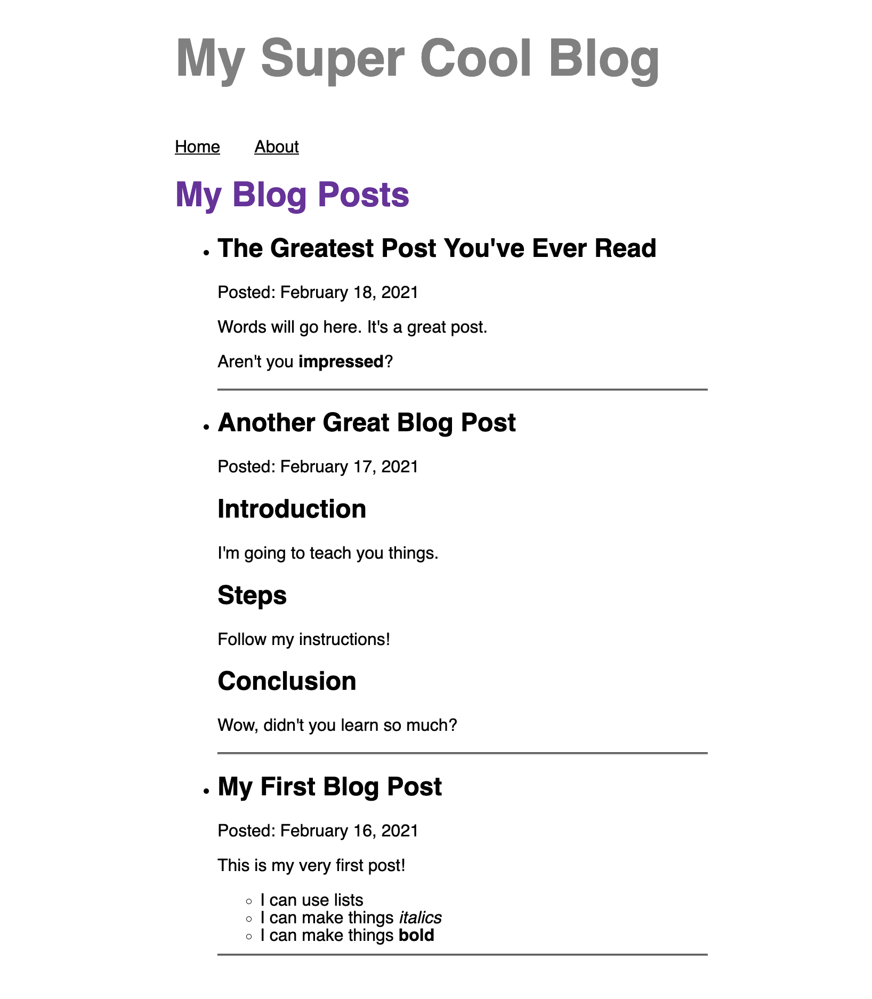

import PreviousNext from "../../components/nav/previous-next";
import Calloutbox from "../../components/callout-box";

## Introduction

So far, you've used the `gatsby-source-filesystem` plugin to build a blog page that can list the names of your blog posts. But `gatsby-source-filesystem` doesn't know anything about how to process MDX files, so it doesn't now how to render the actual contents of your posts.

To display your posts, you'll need to learn about a new plugin that knows how to use MDX files: `gatsby-plugin-mdx`.

## What You Will Learn

By the end of this section, you will be able to:

- Transform File nodes into MDX nodes by using the `gatsby-plugin-mdx` plugin.

## Background

### A Closer Look at Gatsby's GraphQL Data Layer

To understand what the `gatsby-plugin-mdx` plugin does, you need to know a bit more about how Gatsby’s GraphQL data layer works.

Inside the data layer, information is stored in objects called **nodes**. Different source plugins create different types of nodes, each of which have their own properties. For example, `gatsby-source-filesystem` creates File nodes.

Gatsby has a special kind of plugin called a **transformer plugin**, which can convert nodes from one type to another.

The `gatsby-plugin-mdx` plugin transforms File nodes that have the `.mdx` extension into MDX nodes.


### Processing MDX with `gatsby-plugin-mdx`

The `gatsby-plugin-mdx` plugin provides some new tools for you to use in your site:

* The `allMdx` and `mdx` fields (for your GraphQL queries)
* An `MDXRenderer` component (for processing and displaying MDX content)

<Calloutbox>

**Additional Resources:**

* [`gatsby-plugin-mdx` README](https://www.gatsbyjs.com/plugins/gatsby-plugin-mdx)
* [How-To Guide: Add components to content using MDX](https://www.gatsbyjs.com/docs/how-to/routing/mdx/)

</Calloutbox>

#### The `allMdx` and `mdx` fields

Adding `gatsby-plugin-mdx` to your site makes the `allMdx` and `mdx` fields available for you to use in your GraphQL queries.

If you open up GraphiQL after configuring `gatsby-plugin-mdx`, you will see that the Explorer now lists `allMdx` and `mdx` among the other fields you had before.

* Use `allMdx` to query for multiple MDX nodes
* Use `mdx` to query for a specific MDX node. (You'll learn more about that in a later section.)

#### The `MDXRenderer` Component

`gatsby-plugin-mdx` also includes a special component that you can use to render the contents from an MDX file: `MDXRenderer`.

`MDXRenderer` uses the `children` prop, similar to the `Layout` component you created earlier. You can pass in the value of the `body` field from an MDX node.

```javascript
import { MDXRenderer } from 'gatsby-plugin-mdx'

<MDXRenderer>
  { node.body }
</MDXRenderer>
```


## Exercise #1: Use `gatsby-plugin-mdx` to render your blog post contents

### Goal

1. Add `gatsby-plugin-mdx` to your site.
1. Update your `/blog` page to display the contents of each `.mdx` blog post.



<details>
  <summary>Hints</summary>

* Remember the three steps for setting up a plugin?
* Update your page query to use `allMdx` instead.
* Use the `<MDXRenderer>` component to render the content of your blog posts.

</details>

<details>
  <summary>Solution</summary>

You'll learn more if you work through the exercise on your own.

But if you get stuck, here's [one possible solution](https://github.com/meganesu/gatsby-intro-workshop-example-site/commit/1f4c843cd1c6c8e4eaba9c62d788665c4aa61b63).

</details>

## Challenge (Extra Credit)

With MDX, you can use components inside your `.mdx` files. Try adding a component to one of your blog posts.

<details>
  <summary>Hints</summary>

Need help with the syntax? Check out the Gatsby documentation on [Writing Pages in MDX](https://www.gatsbyjs.com/docs/mdx/writing-pages/).

</details>

## Summary

The key takeaways from this section are:

- Transformer plugins convert nodes in the data layer from one type to another.
- `gatsby-plugin-mdx` transforms file nodes to MDX nodes.

<Calloutbox>

**Share Your Feedback!**

You can help us improve this workshop by using this [feedback form](https://docs.google.com/forms/d/e/1FAIpQLScQSMjKfAaukPiiwvPTpIG3nKEF5pjY0Y_nZX6TGj0L9Tx31w/viewform?usp=pp_url&entry.2075407804=Part+5) to tell us what you liked or didn't like about this part of the workshop.

</Calloutbox>

<PreviousNext
  prevTo="/part-4"
  prevText="Part 4"
  nextTo="/part-6"
  nextText="Part 6"
/>
