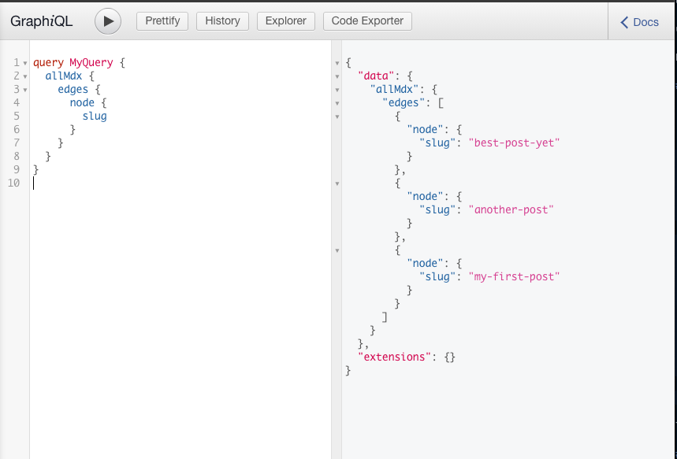
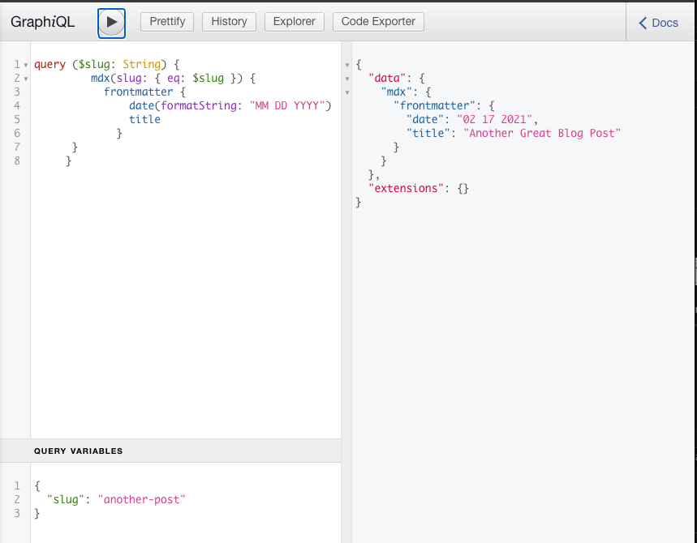

import PreviousNext from "../../components/nav/previous-next";
import Calloutbox from "../../components/callout-box";

## Introduction

Now that you have an idea of what it looks like to transform content using a Plugin and how queries work. You will now build on top of that knowledge to create pages from a data source, using Gatsby's Internal APIs 


## What You Will Learn

By the end of this section, you will be able to:

- Create pages programmatically with Routes API
- Use Query variables to source particular pages 

## Background

### What are programmatic pages?

When Gatsby creates pages from the `/pages` directory it does so because these pages are already in this direcctory. That is to say they are already defined before the build.

But it is impossible to know everything at build time, if you have some of your pages that are created from a CMS or from a source that isn't known at build time, you most likly want to create these pages programmatically create pages with File system routes API 

<!-- - Separate sections (labeled by `h3` titles) explaining all the content students will need to be able to complete the exercises. -->

### What is Gatsby's Filesystem Routes API?

Gatsby [infers](https://www.gatsbyjs.com/docs/glossary/#inference) data sources it is connected to at build time thats why you notice stuff like `all-- Followed by the name of the source` in Graphiql. This can be `allMarkdownRemark` or `allFiles`, this creates [nodes](https://www.gatsbyjs.com/docs/glossary#node)
for the sourse and you can use the File System Route API to access node information directly from the file path using collection routes. 

### Using Filesystem API

To use the File System Route API, because the pages you want to create will be available at runtime you need to create a template for the pages to map into. 

Use curly braces `({ })` in your filename to tell Gatsby that the content of this page is dynamic. So `src/pages/products/{Product.name}.js` will generate a route like `/products/burger`. You can implement your own version in these steps:

1. Create a folder called `blog` inside the folder create a file `{mdx.slug}`
2. Write a query for a single page using query variables and Graphiql
    - In Graphiql if you write a query to get back all the slugs as seen below because this is a way to differentiate one page from another
    
    

    -  Now that you know each slug you an now use it to query for each individual page using variables. In Graphiql you can see the `query variables` section this is where you input the slug you want tp query for.  

    

    In the code block below you can see `($slug: String)` after the query what this does is define the slug as a string. `(slug: { eq: $slug })` sets the value of slug provided to the queries slug, and ensures that the slug is equal to the query variable.

      ```graphql
      query ($slug: String) {
         mdx(slug: { eq: $slug }) {
           frontmatter {
               date(formatString: "MM DD YYYY")
               title
             }
        body
      }
     } 
     ```

3. Use `MDXRenderer` to show the content of the `MDX` files
    - In the query above you can see that you query for the body, when you get this body content it doesn't render in readable format so you will use the `MDXRenderer` in other to show the content of body.
    - `import { MDXRenderer } from "gatsby-plugin-mdx";` in your `{MDX.slug}.js` file. 
    - Use the query accessible yo your component by passing `{ data }` as props and inside your `MDXRenderer` component query for the body using dot notation.  

#### Additional Resources

- [File system API](https://www.gatsbyjs.com/docs/reference/routing/file-system-route-api/#collection-routes) -  This is the documentation on using the File system API

## Exercise #1: Create separate pages for each blog post

### Goal

1. Use the File System Route API to automatically create separate pages for each of your blog posts.
1. Link each post title on the `/blog` page to the corresponding page for that post.

<details>
  <summary>Hints</summary>

1. Create a new file for your blog post template page under pages directory like so: `pages/blog/{mdx.slug}.js` 
1. Define the new component for your blog post template.
    * Write the query to pull in data for a single post.
    * Move the `<MDXRenderer>` code out of the `/blog` page and into the template page.

</details>

<details>
  <summary>Solution</summary>

You'll learn more if you work through the exercise on your own.

But if you get stuck, here's [one possible solution](https://github.com/meganesu/gatsby-intro-workshop-example-site-with-v3/compare/part5-exercise1...part6-exercise1).

</details>

## Challenge (Extra Credit)

Source a list of cities from Contenful CMS and programmatically create pages for the resources from the home page. 

## Summary

The key takeaways from this section are:

- Query variables allow you to get specific pages in a query
- You can use the File system routes API to programmatically create pages 
- MDXRenderer displays MDX pages to the screen

In the next section, you'll learn about adding dynamic images to your sites using `GatsbyImage` 

<Calloutbox>

**Share Your Feedback!**

You can help us improve this workshop by using this [feedback form](https://docs.google.com/forms/d/e/1FAIpQLScQSMjKfAaukPiiwvPTpIG3nKEF5pjY0Y_nZX6TGj0L9Tx31w/viewform?usp=pp_url&entry.2075407804=Part+6) to tell us what you liked or didn't like about this part of the workshop.

</Calloutbox>

<PreviousNext
  prevTo="/part-5"
  prevText="Part 5"
  nextTo="/part-7"
  nextText="Part 7"
/>
