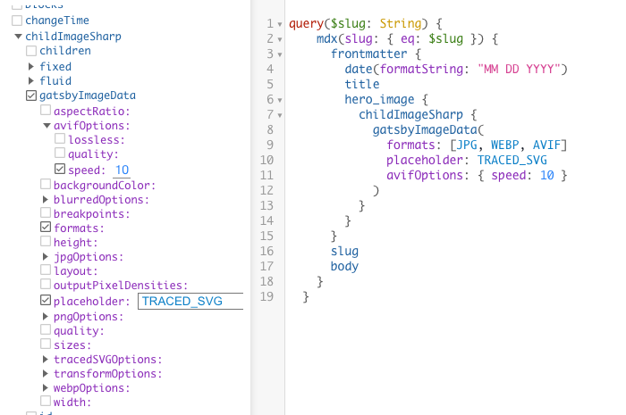

import PreviousNext from "../../components/nav/previous-next";
import Calloutbox from "../../components/callout-box";

## Introduction

In [section 3](/part-3/) you learned about using the `StaticImage` component from `gatsby-plugin-image` plugin. In this section you are going to learn to use the `GatsbyImage` component which
allows you to load dynamic images into your components while optimizing with specific options and formats

## What You Will Learn

By the end of this section, you will be able to:

- Change size and Layout of images using `gatsbyImageData` resolver arguments
- Lazy load images to components 

## Background

### What are dynamic images 

You can think of dynamic images as images that come from a data source (such as a CMS) or in this case your MDX files. You can load them via GraphQL and display them using the GatsbyImage component.

### Using `GatsbyImage` and `getImage()`

1. Add image query to your original query. Note that any GraphQL File object that includes an image will have a childImageSharp field that you can use to query the image data.

2. Configure `gatsbyImageData` with arguments: There are a couple of arguments accepted by the `gatsbyImageData` resolver like, format, placeholder. There are also advanced image processing options available
   In Graphiql you can select these options

 

They you will have the query below. 

```graphql
 query($slug: String) {
    mdx(slug: { eq: $slug }) {
      frontmatter {
        date(formatString: "MM DD YYYY")
        title
        hero_image {
          childImageSharp {
            gatsbyImageData(
              formats: [JPG, WEBP, AVIF]
              placeholder: TRACED_SVG
              avifOptions: { speed: 10 }
            )
          }
        }
      }
      slug
      body
    }
  }

```
3. Display the image

To display the image on the screen you will want to `import { GatsbyImage, getImage } from "gatsby-plugin-image"`.
The `getImage()` function is an optional helper to make your code easier to read. We use 

```javascript
const BlogPosts = ({ data }) => {
  const image = getImage(data.mdx.frontmatter.hero_image);
  return (
    <Layout>
      <GatsbyImage image={image} aria-hidden={true} />
      <MDXRenderer>{data.mdx.body}</MDXRenderer>
    </Layout>
  );
};

```


## Exercise #1: Add a dynamic hero image to each blog post

### Goal

Use the dynamic `<GatsbyImage>` component from `gatsby-plugin-image` to add a hero image to each blog post.

<details>
  <summary>Hints</summary>

1. Download a hero image for each blog post, and put them in your `/blog` folder.
1. Create a new field in the front matter for each `.mdx` file with the relative path to the hero image.
1. Use the `<GatsbyImage>` component and `getImage()` function to render the hero image in your blog post template.
  
</details>

<details>
  <summary>Solution</summary>

You'll learn more if you work through the exercise on your own.

But if you get stuck, here's [one possible solution](https://gist.github.com/Ekwuno/9c023648c4190b35f0e7ace9ae84b9d0).


</details>


## Summary

The key takeaways from this section are:
- GatsbyImage resolver gives parameter that allow you to pick formats for your dynamic image, also the placehoder effects can be : Blurry, dominant color or TRACED_SVG
- The `getImage()` function is an optional helper to make your code easier to read.

<Calloutbox>

**Share Your Feedback!**

You can help us improve this workshop by using this [feedback form](https://docs.google.com/forms/d/e/1FAIpQLScQSMjKfAaukPiiwvPTpIG3nKEF5pjY0Y_nZX6TGj0L9Tx31w/viewform?usp=pp_url&entry.2075407804=Part+7) to tell us what you liked or didn't like about this part of the workshop.

</Calloutbox>

<PreviousNext prevTo="/part-6" prevText="Part 6" />
